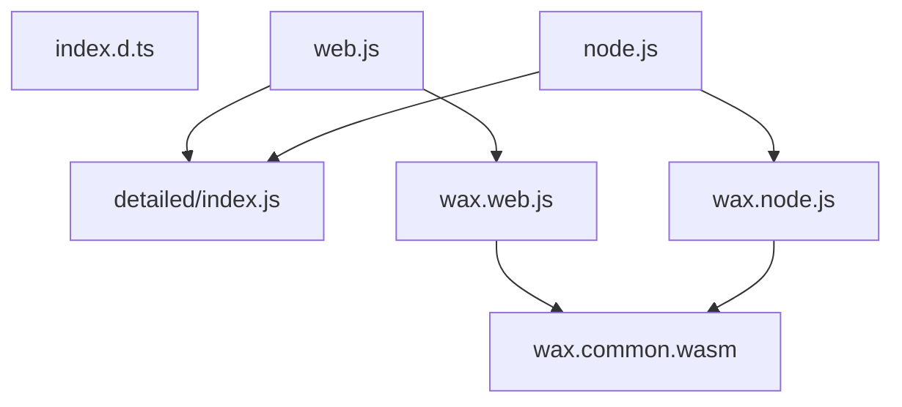

# Typescript part architecture design

## Library source code consist of three main parts:

  - [Hive protocol ProtoBuf definitions (.proto files)](../hive/libraries/protocol/proto) - directly shared from [Hive](gitlab.syncad.com/hive/hive) repository, resulting in generating Typescript code containing blockchain operation definitions
  - C++ core part (reusing [Hive protocol structures and algirithms](../hive/libraries/protocol) built into [WASM](https://webassembly.org/) form being ready for execution in Web Browser
  - Typescript & JavaScript implementation of public Wax interfaces, joining together previously mentioned parts

## Generation flow

1. [Hive .proto files](../hive/libraries/protocol/proto) are transformed into the TypeScript representation using [`protoc` compiler](https://github.com/protocolbuffers/protobuf) and its [`ts-proto` extension](https://www.npmjs.com/package/ts-proto). Output files will be located under `wasm/lib/proto` directory.

1. Then [Wax C++ core](./core) and direct [TS <-> C++ bridge](./wasm/src) parts are compiled into the WASM representation using [Emscripten compiler](https://emscripten.org/). This process involves building of multiple project targets:

    1. `wax_wasm_node` targeting NodeJS environment generating: [wax.node.js](#waxnodejs) and [wax.node.wasm](#waxcommonwasm), `wax_node.d.ts` files
    1. `wax_wasm_web` targeting Web Browser resulting in [wax.web.js](#waxwebjs), [wax.web.wasm](#waxcommonwasm) and `wax_web.d.ts` outputs

    **What important to note, both targets should generate files having the same content**:

      - wasm outputs ( [wax.node.wasm](#waxcommonwasm) and [wax.web.wasm](#waxcommonwasm) ) finally renamed during installation to `wax.common.wasm`
      - `*.d.ts` files containing type generated C++ <-> TS interface types
      - `config.ts` - this file is just for full typing of protocol config

    All outputs are generated into `wasm/build_wasm` directory (containing also intermediate build files). Final outpus are installed into `wasm/lib/build_wasm`.

1. Now, having all of the dependencies in place (generated in previous steps), main [TS & JS implementation](./wasm/lib) sources can be compiled by [TypeScript compiler](https://www.npmjs.com/package/typescript) using settings specified in [given configuration](tsconfig.json). This phase outputs are placed in `wasm/dist/lib` directory.

1. Finally, all of produced JavaScript sources and type declarations can be bundled together using [Rollup](https://www.npmjs.com/package/rollup) in order to create files that will be available in the [final bundle](#final-bundle-files). Rollup, currently has 5 stages configured with bundle directory `wasm/dist/bundle`:
    1. Copy [wax.web.js](#waxwebjs) and [wax.node.js](#waxnodejs) into the bundle directory along setting proper WASM file path. Also terser will slice lines into smaller parts for more readable error stack trace reading.
    1. Copy [wax.common.wasm](#waxcommonwasm) into the bundle directory.
    1. Bundle ["second layer" of Wax library](wasm/lib/detailed) into one file imported by [web.js](#webjs) and [node.js](#nodejs) files. Also proper environment variables will be hardcoded, such as: version and package name. Terser will optimize code and all non-crucial dependencies will be inlined
    1. Transpile [library entry file](wasm/lib/index.ts) into two files: [web.js](#webjs) and [node.js](#nodejs), properly replacing WASM imports. Note that file [wasm/lib/wax_module.js](wasm/lib/wax_module.ts) is just a dummy file representing proper type declarations for the [wax.web.js](#waxwebjs) and [wax.node.js](#waxnodejs) files and it will not be bundled, but replaced with the mentioned files instead.
    1. Bundle all of the type declarations and output them into the [index.d.ts](#indexdts) file

## Final bundle files

### wax.common.wasm

Contains the core WebAssembly code shared across environments.

### wax.web.js

Specialized WASM communication wrapper for running in the web environment - generated by Emscripten

### wax.node.js

Specialized WASM communication wrapper for running in the Node.js environment - generated by Emscripten

### web.js

Index file to load the environment-specific code in the browser. Its main purpose is to load `wax.web.js` and `detailed/index.js`

### node.js

Index file to load the environment-specific code in the Node.js. Its main purpose is to load `wax.node.js` and `detailed/index.js`

### detailed/index.js

Main bundle covering the library functionality described by its [public interface](wasm/lib/detailed/interfaces.ts) - "second layer" of the Wax library containing e.g. broadcasting transaction code, healthchecker and formatters.

### index.d.ts

Consolidated type declarations for all environments

## Final bundle dependency graph

